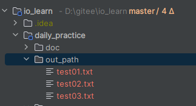
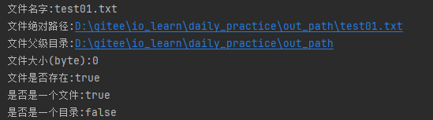

### 一、文件

文件是保存数据的地方，比如word文档、txt文档、excel文件…都是文件。

### 二、文件流

文件在程序中是以流的形式来操作的。

```
流：数据在数据源（文件）和程序（内存）之间经历的路径
输入流：数据从数据源（文件）到程序（内存）的路径
输出流：数据从程序（内存）到数据源（文件）的路径
```

### 三、常用的文件操作

#### (1)创建文件

```java
/**
 * 常用的文件操作
 */
public class CommonOperation {
    /**
     * 创建文件
     */
    public static void main(String[] args) {
        System.out.println(Thread.currentThread().getName() + "开始创建");
        createFileByPath();
        create02();
        create03();
        System.out.println(Thread.currentThread().getName() + "结束创建");
    }

    /**
     * 根据路径创建
     */
    public static void createFileByPath() {
        String filePath = "D:\\gitee\\io_learn\\daily_practice\\out_path\\test01.txt";
        File file = new File(filePath);
        try {
            file.createNewFile();
            System.out.println("文件test01.txt创建成功!");
        } catch (IOException e) {
            throw new RuntimeException(e);
        }
    }

    /**
     * 根据父目录（File类型）+子路径创建
     */
    public static void create02() {
        File parentFile = new File("D:\\gitee\\io_learn\\daily_practice\\out_path\\");
        String fileName = "test02.txt";
        File file = new File(parentFile, fileName);
        try {
            file.createNewFile();
            System.out.println("文件test02.txt创建成功!");
        } catch (IOException e) {
            throw new RuntimeException(e);
        }
    }

    /**
     * 根据父目录(String类型)+子路径创建
     */
    public static void create03() {
        String parentPath = "D:\\gitee\\io_learn\\daily_practice\\out_path\\";
        String fileName = "test03.txt";
        File file = new File(parentPath, fileName);
        try {
            file.createNewFile();
            System.out.println("文件test03.txt创建成功!");
        } catch (IOException e) {
            throw new RuntimeException(e);
        }
    }
}
```



#### (2)获取文件相关信息

```java
    /**
     * 获取文件相关信息
     */
    public static void getFileInfo(){
        File file = new File("D:\\gitee\\io_learn\\daily_practice\\out_path\\test01.txt");
        System.out.println("文件名字:"+file.getName());
        System.out.println("文件绝对路径:"+file.getAbsolutePath());
        System.out.println("文件父级目录:"+file.getParent());
        System.out.println("文件大小(byte):"+file.length());
        System.out.println("文件是否存在:"+file.exists());
        System.out.println("是否是一个文件:"+file.isFile());
        System.out.println("是否是一个目录:"+file.isDirectory());
    }
```



#### (3)目录的操作和删除

```java
    /**
     * 目录的操作和删除
     */
    public static void dirOperation() {
        File file = new File("D:\\gitee\\io_learn\\daily_practice\\out_path\\test01.txt");
        if (file.exists()) {
            if (file.delete()) {
                System.out.println("test01.txt删除成功!");
            }
        } else {
            System.out.println("文件test01.txt不存在!");
        }
    }

    /**
     * 在java中，目录也当成文件来处理
     */
    public static void dirOperation01() {
        File file = new File("D:\\gitee\\io_learn\\daily_practice\\demo");
        if (file.exists()) {
            if (file.delete()) {
                System.out.println("demo删除成功!");
            } else {
                System.out.println("demo删除失败!");
            }
        } else {
            System.out.println("目录demo不存在!");
        }
    }
```

#### (4)创建一级或者多级目录

```java
 /**
     * 创建一级目录
     */
    public static void createSigDir(){
        String directoryPath = "D:\\gitee\\io_learn\\daily_practice\\out_path\\a";
        File file = new File(directoryPath);
        if(file.exists()) {
            System.out.println(directoryPath + "目录存在!");
        } else {
            if(file.mkdir()) {
                System.out.println(directoryPath + "目录创建成功!");
            } else {
                System.out.println(directoryPath + "目录创建失败!");
            }
        }
    }


    /**
     * 创建多级目录
     */
    public static void createMutiDir(){
        String directoryPath = "D:\\gitee\\io_learn\\daily_practice\\out_path\\a\\b\\c";
        File file = new File(directoryPath);
        if(file.exists()) {
            System.out.println(directoryPath + "目录存在!");
        } else {
            if(file.mkdirs()) {
                System.out.println(directoryPath + "目录创建成功!");
            } else {
                System.out.println(directoryPath + "目录创建失败!");
            }
        }
    }
```


### IO流原理及流的分类

#### 1、io原理

```
（1）I/O是Input/Output的缩写，I/O技术是非常实用的技术，用于处理数据传输。如：读/写文件，网络通讯等；

（2）Java程序中，对于数据的输入/输出操作以"流（stream）"的方式；

（3）java.io包下提供了各种"流"类和接口，用以获取不同种类的数据，并通过方法输入或输出数据；

（4）输入input：读取外部数据（磁盘、光盘等存储设备的数据）到程序（内存）中；

（5）输出output：将程序（内存）数据输出到磁盘、光盘等存储设备中。
```

#### 2、流的分类

```
（1）按操作数据单位不同分为：字节流（8 bit）、字符流

（2）按数据包流的流向不同分为：输入流、输出流

（3）按流的角色不同分为：节点流、处理流/包装流
```

| 抽象基类 | 字节流       | 字符流 |
| -------- | ------------ | ------ |
| 输入流   | InputStream  | Reader |
| 输出流   | OutputStream | Writer |

Java的IO流共涉及40多个类，实际上非常规则，都是从如上4个抽象基类派生的。由这四个类派生出来的子类名称都是以其父类名作为子类名后缀。


### 输入流、输出流

#### 1、InputStream(字节输入流)

InputStream抽象类是所有字节输入流的超类。

常用子类：

```java
FileInputStram：文件输入流

BufferedInputStream：缓冲字节输入流

ObjectInputStream：对象字节输入流
```

(1)FileInputStram相关构造方法:

```java
FileInputStream(File file)

通过打开一个到实际文件的连接来创建一个 FileInputStream，该文件通过文件系统中的 File 对象 file指定。

FileInputStream(String name)

通过打开一个到实际文件的连接来创建一个 FileInputStream，该文件通过文件系统中的路径名name指定。

FileInputStream(FileDescriptor fdObj)

通过使用文件描述符fdfdObj创建一个 FileInputStream，该文件描述符表示到文件系统中某个实际文件的现有连接。
```

#### 2、OutputStream(字节输出流)

OutputStream抽象类是所有字节输出流的超类。

常用子类:

```

```

(2)FileOutputStream相关构造方法：

```java
FileOutputStream(File file)

创建文件输出流以写入由指定的File对象表示的文件。

FileOutputStream(String name)

创建文件输出流以写入具有指定名称的文件。

FileOutputStream(File file, boolean append)

创建文件输出流以写入由指定的File对象表示的文件。 如果第二个参数是true ，则字节将写入文件的末尾而不是开头。

FileOutputStream(String name, boolean append)

创建文件输出流以写入具有指定名称的文件。 如果第二个参数是true ，则字节将写入文件的末尾而不是开头。

FileOutputStream(FileDescriptor fdObj)

创建要写入指定文件描述符的文件输出流，该文件描述符表示与文件系统中实际文件的现有连接
```

